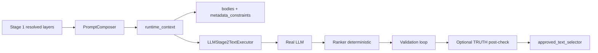

# Implementation Plan — §3.3 Stage 2 — grounding слоёв и удержание TRUTH

Author: Dev B / Dev C  
Date: 2026-07-04  
Status: **done (code + CI)** — manual `--executor llm` TRUTH checklist pending (runbook § TRUTH manual checklist)  
Review: lead + tech reviewer (2026-07-04)  
Closed: 2026-07-04 (PR-1..5 merged; automated tests green)

---

## 1. Problem understanding

Stage 1 после §3.2 корректно резолвит `truth_mode`, subjects, layers (`TRUTH_BASE`, `TRUTH_ANIMAL_FOX`, age, style, …). Stage 2 **знает id слоёв**, но **не подкладывает их правила в LLM prompt**. На real LLM approved texts в TRUTH содержат сказочные клише:

```text
«Жила-была лиса…», прямая речь животных, anthropomorphic social logic, фактическая «магия»
```

Wave 11 формулировка:

```text
System knows which rule layer was selected,
but generated result does not always behave as if that rule was active.
```

### Scope §3.3 vs общий fix

| Аспект | Область |
|--------|---------|
| **Root cause (grounding)** | **Все режимы и все layer types** — TRUTH, FAIRY_TALE, MYTH, age, style, entity, utility |
| **Acceptance / manual tests §3.5** | **TRUTH-first** — запросы #2, #8, #13 и Wave 11 fox scenarios |
| **Deterministic post-check** | **TRUTH-only** (optional, на согласование lead) |

Out of scope §3.3: Stage 1 interpretation (§3.2), length limits (§3.4), full teaching utility deep pass, legacy (§3.7).

### Связанные дефекты

| # | Проблема | Статус в коде |
|---|----------|---------------|
| P1 | Layer bodies не попадают в LLM prompt Stage 2 | **Broken** — `body_policy=lazy_not_persisted`; `_build_prompt` не сериализует `bodies` / `metadata_constraints` |
| P2 | Scorer/validator enforcement только через LLM self-report | **Weak** — нет independent truth check по тексту |
| P3 | Golden tests не ловят natural-language fairy tale | **Gap** — только scripted markers (`__BAD_TALKING__`) |
| P4 | `character_consistency` required для всех gates | **Risk** — после §3.2 TRUTH animal `is_character=false`; gate может ложно fail/pass |
| P5 | Validator `accepted` + non-empty `issues` | **Done** — `stage2_llm_executor.py` downgrade → `needs_revision`; tests `test_validate_candidate_never_accepts_*` |
| P6 | `_normalize_score` default missing gate → `"pass"` | **Risk** — optimistic fallback в `stage2.py` |

---

## 2. Current state analysis

### 2.1 Что Stage 2 передаёт в LLM сегодня

`PromptComposer.build_stage_context()` собирает:

- `normalized_request_summary` — **включая `truth_mode`** ✅
- `ordered_layer_refs` — id, type, role ✅
- `metadata_constraints` — short_description + constraints[] из YAML ✅ **в runtime_context**
- `bodies` — только если `body_policy=include_bodies_runtime` ❌ **не используется в Stage 2 nodes**

`LLMStage2TextExecutor._build_prompt()` сериализует:

```text
normalized_request_summary
prompt_context.ordered_layer_ids          ← только id
stage_context.stage_instructions          ← generic profile names
stage_context.context_blocks              ← имена блоков, не содержимое
hard_details / soft_preferences
```

**Не сериализует:** `metadata_constraints`, `bodies`, stage profile bodies (`SCORER.md`, `VALIDATOR_CANDIDATE_TEXT.md`).

### 2.2 Pipeline enforcement сегодня

```text
generator (LLM) → scorer (LLM hard_gates) → ranker (all gates == "pass")
  → validator (LLM) → refiner (LLM) → approved_text_selector (trusts validation_status)
```

Нет deterministic проверки текста против TRUTH rules между validator и selector.

### 2.3 Golden / CI blind spot

`GoldenStage2Executor.score_candidates` — **всегда `truth_fit=pass`**.  
`validate_candidate` — ловит только explicit markers в тексте.  
Natural «Жила-была…» без маркера **не тестируется** в CI.

### 2.4 Что уже работает (не ломать)

- Stage 1 TRUTH resolution + `is_character=false` (§3.2)
- Validation loop routing (needs_revision → refiner → re-validate)
- Validator contract: `accepted` + any `issues` → `needs_revision` (executor)
- Ranker: `unknown` / `fail` gates не проходят (только `"pass"`)
- Golden regressions для scripted TRUTH violations (`truth_hedgehog`, `__BAD_TALKING__`)

---

## 3. Proposed solution

### 3.1 Принцип: один infrastructure fix → все режимы

**Не делаем** `if truth_mode == TRUTH` для grounding.  
**Делаем** universal Stage 2 prompt enrichment для всех LLM nodes:

| Node | body_policy (proposed) |
|------|------------------------|
| `candidate_text_generator` | `include_bodies_runtime` |
| `scorer` | `include_bodies_runtime` |
| `candidate_validator` | `include_bodies_runtime` |
| `candidate_refiner` | `include_bodies_runtime` |

`topic_deduplicator` — без изменений (compact context достаточен).

### 3.2 Целевая архитектура Stage 2 prompt

```text
Stage 1 prompt_context (resolved_layers)
  → PromptComposer (include_bodies_runtime)
       ordered_layer_refs
       metadata_constraints[id] = { short_description, constraints[] }
       bodies[id] = full markdown body from registry
  → LLMStage2TextExecutor._build_prompt
       normalized_request_summary
       layer_grounding = { metadata_constraints, bodies }   ← NEW
       stage_inputs + contract
  → LLM (generator | scorer | validator | refiner)
```



### 3.3 Изменения по файлам

| Файл | Изменение |
|------|-----------|
| `src/core/nodes/stage2.py` | `body_policy="include_bodies_runtime"` во всех `build_stage_context()` для LLM nodes; fix `_normalize_score` missing gate → `"unknown"` |
| `src/core/stage2_llm_executor.py` | `_build_prompt`: добавить `layer_grounding` (`metadata_constraints`, `bodies`); optional: human-readable preamble «apply these layer rules» |
| `src/core/prompts/composer.py` | без breaking changes; при необходимости — helper `_layer_grounding_payload()` для тестируемости |
| `src/core/stage2/truth_post_check.py` *(new, optional PR)* | deterministic TRUTH violations перед durable accept |
| `tests/...` | unit + integration (см. §7) |
| docs | см. §9 |

**Durable persistence:** `body_policy` в `StagePromptContextEntry` станет `include_bodies_runtime`; bodies **не** пишем в session JSON (как и задумано в composer — runtime only).

### 3.4 TRUTH enforcement (поверх grounding)

Grounding — **обязательный минимум**. Дополнительно (рекомендуемый пакет):

#### A. Prompt task strings (executor)

Уточнить `task` для scorer / validator / refiner при `truth_mode=TRUTH`:

- scorer: «In TRUTH, fail truth_fit for fairy-tale framing, speaking animals as fact, factual magic»
- validator: «Cross-check candidate text against TRUTH_BASE and entity layer bodies»
- refiner: «Remove truth violations; preserve theme/subject; do not switch to fairy tale»

Реализация: conditional task suffix из `normalized_request_summary.truth_mode` — **без** дублирования bodies (они уже в payload).

#### B. `character_consistency` policy (sync §3.2)

| Condition | Gate behavior |
|-----------|---------------|
| `character_profile` absent **and** all subjects `is_character=false` | scorer instruction: auto `pass`; ranker не блокирует |
| `character_profile` present or any `is_character=true` | enforce as today |

Код: документировать в scorer task + optional deterministic override в `_normalize_score` / ranker helper (если LLM вернул fail без character).

#### C. Deterministic TRUTH post-check *(approved — PR-3 in MVP)*

Lightweight module **после** validator `accepted`, **до** append `validated_candidate_versions`:

```text
if truth_mode == TRUTH and post_check.fail(text):
    downgrade to needs_revision (not hard reject)
    issues += [{ type: truth_fit, severity: major, ... }]
```

**Marker categories** (lead approved §3.4.C):

| Category | MVP | Examples (RU) | Notes |
|----------|-----|---------------|-------|
| **1. Fairy opening** | **yes** | «жила-была», «в некотором царстве», «однажды в сказочном» | manual §3.5: explicit ban «сказочное вступление» in TRUTH |
| **2. Direct animal speech** | **yes** | «лиса сказала:», «ёжик ответил», «спросил лису» | regex + context |
| **3. Factual magic** | time-permitting | «наколдовал», «заклинание сработало» (as real event) | only if time remains after cat 1–2 |
| **4. Anthropomorphic roles** | **defer** | animal pays, signs contract, moral judge | v2 or LLM-only |

False positive mitigation: post-check → `needs_revision`; refiner gets issue. TRUTH_BASE «ребёнок представил…» — exclude in v2 if needed.

---

## 4. PR strategy

| PR | Scope | Merge gate |
|----|-------|------------|
| **PR-1** | Universal grounding: `include_bodies_runtime` + `_build_prompt` layer_grounding | unit: prompt contains TRUTH_BASE body; composer integration |
| **PR-2** | TRUTH-aware task strings + `character_consistency` policy in scorer/validator tasks; `_normalize_score` fix | unit executor + stage2 nodes |
| **PR-3** | Deterministic TRUTH post-check (categories 1–2; cat 3 time-permitting) + wire before accept | unit post-check; integration natural-language fail |
| **PR-4** | Integration tests: `LenientStage2Executor` + grounding path; golden regressions | full pytest green, no external LLM |
| **PR-5** | Docs + runbook TRUTH checklist appendix + master plan §3.3 → `done` | manual `--executor llm` gate before §3.3 close |

**Merge order:** PR-1 → PR-2 → PR-3 → PR-4 → PR-5.

**Prerequisite:** §3.2 functionally ok; commit untracked `interpretation/` + tests желателен до merge §3.3 in main. PR-1 можно начинать параллельно на той же ветке.

**Estimate:** 3–5 dev-days (matches master plan).

---

## 5. Test plan

### 5.1 Unit tests (no external LLM)

| ID | Test | Assert |
|----|------|--------|
| U1 | `build_stage_context` generator with TRUTH fox | `bodies["TRUTH_BASE"]` non-empty; `metadata_constraints` present |
| U2 | `_build_prompt` includes layer_grounding | JSON payload contains body text from `TRUTH_BASE.md` |
| U3 | `_build_prompt` FAIRY_TALE request | `FAIRY_TALE_BASE` body present (proves universal fix) |
| U4 | `_normalize_score` missing hard_gate | defaults to `"unknown"`, not `"pass"` |
| U5 | validator accepted + issues | still `needs_revision` (regression) |
| U6 | character_consistency task when no profile | scorer task mentions auto-pass (snapshot test) |
| U7 | post-check «жила-была» *(PR-3)* | fail truth_fit |
| U8 | post-check TRUTH-approved golden text | pass |

Files: `tests/unit/test_stage2_llm_executor.py`, `tests/unit/test_stage2_nodes.py`, `tests/unit/test_prompt_composer.py`, `tests/unit/test_stage2_truth_post_check.py` *(PR-3)*.

### 5.2 Integration tests (GoldenStage2Executor + new mock)

| ID | Test | Assert |
|----|------|--------|
| I1 | `test_truth_hedgehog_winter_stories_reach_approved_texts` | no regression |
| I2 | `test_truth_animal_talking_like_person_is_not_approved` | no regression |
| I3 | **New:** `LenientScorerExecutor` passes fairy text, validator with grounding catches OR post-check catches | no approved fairy framing |
| I4 | FAIRY_TALE fox golden | still completes (no TRUTH post-check false block) |
| I5 | TRUTH fox `is_character=false` golden | no character_consistency block |

**New test helper:** `LenientStage2Executor` — scorer always pass, validator uses simplified rules OR relies on post-check — simulates real LLM leniency without network.

### 5.3 Manual (§3.5 prep, after PR-4/5)

| Request | Executor | Checklist |
|---------|----------|-----------|
| `2 правдивых истории про лису для 5 лет` | `--executor llm` | no «жила-была»; no animal direct speech as fact; observable animal behavior |
| `1 правдивая история про ёжика зимой для 3 лет` | llm | same + age-appropriate tone |
| FAIRY_TALE control | llm | fairy framing **allowed** — no post-check regression |

Record session_ids in runbook appendix.

---

## 6. Risks and mitigations

| Risk | Mitigation |
|------|------------|
| Prompt token bloat (many layer bodies) | MVP: no cap (lead Q5); measure on 3 manual TRUTH sessions; cap follow-up if grounding block > ~8K tokens |
| FAIRY_TALE wrongly blocked by TRUTH post-check | post-check only when `truth_mode=TRUTH` |
| Post-check false positives («жила-была» in child imagination frame) | start with needs_revision; TRUTH_BASE allows «ребёнок представил…» — exclude quoted imagination patterns in v2 |
| Golden tests break on prompt hash | stage_context_hash will change — expected; update snapshots if any |
| Real LLM still lenient after grounding | PR-3 post-check as safety net; manual §3.5 gate |
| `character_consistency` false fails | PR-2 policy + tests |

**Blockers:** none. PR-3 approved (lead 2026-07-04).

---

## 7. Lead decisions (Q1–Q5) — 2026-07-04

| # | Decision | Comment |
|---|----------|---------|
| **Q1** | **Yes, PR-3 in MVP** | Categories **1–2 only** (fairy opening + direct animal speech). Cat 3 — time-permitting; Cat 4 — defer. Post-check → `needs_revision`. |
| **Q2** | **Approved** | Table §3.4.C + manual §3.5 ban «сказочное вступление» in TRUTH → runbook appendix (PR-5). |
| **Q3** | **Yes** | Universal grounding = **PR-1 one PR**. TRUTH = acceptance focus, not separate bodies path. |
| **Q4** | **Strict** | Any non-empty `issues` → `needs_revision`. Do not change. |
| **Q5** | **No cap in MVP** | Measure token size on 3 manual TRUTH sessions; cap follow-up if > ~8K tokens on grounding block. |

---

## 8. Doc updates (after code)

- [x] `docs/02_ENGINEERING/orchestration/02_STAGE_2_TEXT_PIPELINE.md` — § prompt grounding (`include_bodies_runtime`)
- [x] `docs/02_ENGINEERING/contracts/NORMALIZED_STATE_CONTRACT.md` — note: Stage 2 LLM receives full layer bodies at runtime
- [x] `docs/02_ENGINEERING/implementation/MVP_FOLLOW_UP_MASTER_PLAN.md` — §3.3 status
- [x] `docs/02_ENGINEERING/implementation/STAGE_1_2_MVP_RUNBOOK.md` — TRUTH manual checklist appendix
- [x] `IMPLEMENTATION_PLAN_3_3_*` — status → `done (code + CI)`

---

## 9. Estimated effort

| Scope | Effort |
|-------|--------|
| PR-1 grounding | 1–1.5 days |
| PR-2 tasks + character_consistency + normalize fix | 0.5–1 day |
| PR-3 post-check (categories 1–2) | 1–1.5 days |
| PR-4 tests | 1 day |
| PR-5 docs + manual prep | 0.5 day |
| **Total §3.3** | **3–5 days** |

---

## 10. Approval checklist (lead + tech reviewer)

- [x] Universal `include_bodies_runtime` for Stage 2 LLM nodes — **ok**
- [x] `_build_prompt` includes `metadata_constraints` + `bodies` — **ok**
- [x] TRUTH acceptance focus; FAIRY_TALE/MYTH benefit without separate code path — **ok**
- [x] PR-3 deterministic post-check — **yes** (categories 1–2)
- [x] TRUTH marker list (§3.4.C) — **approved**
- [x] `character_consistency` auto-pass when no `character_profile` + all `is_character=false` — **ok**
- [x] `_normalize_score` missing gate → `unknown` — **ok**
- [x] No external LLM in CI — **ok**
- [x] Manual `--executor llm` required before §3.3 → `done` — **ok** (does not block merge PR-1..4)

---

## 11. Definition of Done — §3.3

- [x] Layer bodies reach real LLM on generator/scorer/validator/refiner (unit + integration proof; debug artifact path in runbook)
- [ ] TRUTH requests: approved texts pass **manual** checklist T1–T2 (`--executor llm`) — gate for master plan §3.3 → `done`
- [x] `truth_fit` fail path covered in unit/integration tests (`LenientStage2Executor` + post-check)
- [x] Golden hedgehog + fox scenarios green
- [x] FAIRY_TALE control scenario green (`test_stage1_2_truth_enforcement.py`)
- [x] `pytest` green, CI без external LLM (307 tests)
- [x] Docs updated; master plan §3.3 → `done (code + CI)`

---

## 12. Next step

**Manual TRUTH pass** — runbook checklist T1–T3 with `--executor llm`; record session_ids.

After manual gate: master plan §3.3 → `done`; proceed §3.4 length limits → §3.5 structured manual pass.
