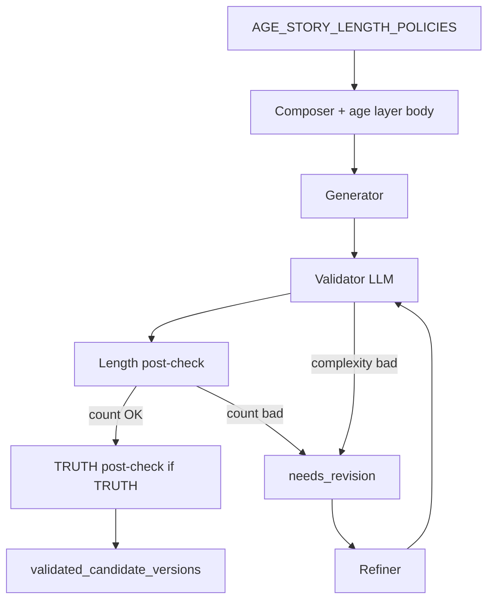

# Implementation Plan — §3.4 Stage 2 — length and sentence-complexity enforcement

Author: Dev C (assigned)  
Date: 2026-07-06  
Status: **`done (code + CI)`** — manual length observations in §3.5 pending  
Review: lead + tech reviewer  
Depends on: §3.3 `done (code + CI)`

**Delegation message:** see `WAVE_12_STAGE2_LENGTH_LIMITS_TASK.md` (copy-paste brief for Dev C).

---

## 1. Problem understanding

Approved texts on real LLM can be **several paragraphs long** while the product expects **short child-facing stories**. Age layers (`AGE_3`, `AGE_5`) already describe vocabulary and “short sentences” qualitatively, but there is **no numeric enforcement** and no deterministic safety net.

Wave 11 formulation:

```text
approved_texts length is unconstrained.
Define length rules by age and decide what to do with overlength text.
```

### Scope §3.4

| In scope | Out of scope |
|----------|--------------|
| Sentence **count** in `text` by `target_age` | Character/byte limits |
| Sentence **complexity** via age layer bodies + validator LLM | Image text overlay length |
| Deterministic post-check (sentence count) | Full age ladder 3.5 / 4 / 4.5 |
| Refiner shorten/simplify path | Prompt budget / grounding compression (separate follow-up) |
| Extensible per-age policy dict | Style-specific length exceptions (Chukovsky) in MVP |

`questions` are **outside** the sentence limit.

### Two dimensions (do not collapse into one counter)

| Dimension | Mechanism |
|-----------|-----------|
| **Macro** — how many sentences | `AGE_STORY_LENGTH_POLICIES` + deterministic post-check |
| **Micro** — how simple each sentence is | `AGE_3` / `AGE_5` bodies (rules + examples) + validator LLM + refiner |

The counter does **not** catch “4 sentences × 40 words with deep participles”. That is validator + age layer territory.

---

## 2. Approved product / engineering decisions (lead 2026-07-06)

Do **not** re-open without lead.

| # | Decision |
|---|----------|
| D1 | Unit: **sentences** in field `text` only; `questions` excluded |
| D2 | **Age 3:** min **3**, max **4** sentences |
| D3 | **Age 5:** min **3**, max **5** sentences |
| D4 | Min 3 enforced **strictly** (2 sentences → `needs_revision`) |
| D5 | **Per-age policy dict** in code — MVP ages `"3"` and `"5"`; new ages = add dict entry, no core rewrite |
| D6 | Sentence complexity: **extend existing** `prompts/ages/3/BASE.md` and `prompts/ages/5/BASE.md` (rules + compact good/bad **sentence** examples). **Do not** add separate `LENGTH_*` layer files |
| D7 | Numeric min/max injected into LLM context from policy (single source of truth); age markdown holds qualitative rules + examples |
| D8 | Enforcement stack: **approach C** — age prompts + validator LLM + **deterministic post-check** + refiner (mirror §3.3 TRUTH pattern) |
| D9 | Overlength / under-min → `needs_revision` (not hard reject on first fail); refiner preserves theme, subjects, `character_profile`, hard details |
| D10 | Issue types: `text_overlength`, `text_underlength`, `sentence_too_complex` (or `age_fit_violation` for complexity) |
| D11 | Post-check runs after validator `accepted`, before durable accept into `validated_candidate_versions` (same hook as `apply_truth_post_check`) |
| D12 | Prompt overload / token budget — **deferred**; keep age examples compact (2–3 good + 2 bad sentences) |

---

## 3. Current state analysis

### 3.1 What exists today

| Asset | State |
|-------|-------|
| `src/config/constants.py` | Global `STORY_SENTENCES_MIN=3`, `STORY_SENTENCES_MAX=5` — **not per-age**, **not enforced** |
| `prompts/ages/3/BASE.md`, `prompts/ages/5/BASE.md` | Qualitative length/complexity; **no numeric limits**, **no sentence examples** |
| `PromptComposer` + §3.3 grounding | Age layer **bodies** reach generator/validator/refiner at runtime ✅ |
| `apply_truth_post_check` | Pattern for post-validator downgrade ✅ |
| Validator / refiner prompts | No explicit length checklist |

### 3.2 Target architecture

```text
Stage 1 target_age
  → AGE_STORY_LENGTH_POLICIES[target_age]
  → PromptComposer (age body + injected sentences_min/max in stage context)
  → LLM generator / validator / refiner
  → validator accepted?
       → apply_length_post_check(text, target_age)
            → fail → needs_revision + issues
       → (TRUTH post-check unchanged, runs after or composed with length check)
  → validated_candidate_versions
```



---

## 4. Proposed solution

### 4.1 Policy module (code)

**New:** `src/core/stage2_length_policy.py` (or `src/config/length_policy.py`)

```python
@dataclass(frozen=True)
class AgeStoryLengthPolicy:
    sentences_min: int
    sentences_max: int
    complexity_profile: Literal["strict", "moderate"]  # metadata for docs/tests

AGE_STORY_LENGTH_POLICIES: dict[str, AgeStoryLengthPolicy] = {
    "3": AgeStoryLengthPolicy(sentences_min=3, sentences_max=4, complexity_profile="strict"),
    "5": AgeStoryLengthPolicy(sentences_min=3, sentences_max=5, complexity_profile="moderate"),
}
DEFAULT_POLICY_AGE = "5"  # fallback when target_age missing/unknown
```

**Migration:** `STORY_SENTENCES_MIN/MAX` in settings — derive from default policy or deprecate with comment pointing to dict.

### 4.2 Age layer content updates

Edit **in place** (not new files):

| File | Add |
|------|-----|
| `prompts/ages/3/BASE.md` | Max 4 short sentences; one action per sentence; no long participial chains; 2–3 ✅ examples + 2 ❌ examples (single sentences) |
| `prompts/ages/5/BASE.md` | Max 5 sentences; moderate cause/effect allowed; limit abstract runs; 2–3 ✅ + 2 ❌ sentence examples |

Keep examples **one line each**. Do not duplicate numeric limits in YAML if composer injects them — optional one line «см. length_policy в контексте».

### 4.3 Composer / executor injection

| File | Change |
|------|--------|
| `src/core/prompts/composer.py` | Add `length_policy` to stage context / `stage_inputs_summary` from `target_age` |
| `src/core/stage2_llm_executor.py` | `_build_prompt`: include `length_policy: { sentences_min, sentences_max, complexity_profile }` |

Validator/refiner task strings (conditional suffix):

- validator: «Check sentence count in `text` against length_policy; check sentence simplicity against active age layer body»
- refiner: «On text_overlength: shorten to ≤ sentences_max; on sentence_too_complex: simplify phrases; preserve theme/subjects»

### 4.4 Deterministic post-check

**New:** `src/core/stage2_length_post_check.py`

Functions:

- `count_story_sentences(text: str) -> int` — split on `.!?…`; trim; MVP heuristics documented in §6
- `check_length_text(text, target_age) -> list[LengthFinding]`
- `apply_length_post_check(validation, *, target_age, text) -> ValidationResult` — same downgrade pattern as TRUTH

Wire in `src/core/nodes/stage2.py` after validator accept, **before or after** TRUTH post-check (order: length first, then TRUTH — both can downgrade).

### 4.5 Validator / refiner prompt files

| File | Change |
|------|--------|
| `prompts/validators/text_pipeline/CANDIDATE_TEXT.md` | Checklist item: length_policy + age layer complexity |
| `prompts/refiners/text_pipeline/CANDIDATE_TEXT.md` | Explicit shorten/simplify instructions; reference issue types |

---

## 5. Phase 0 — documents (before first line of code)

**Gate:** lead ok on this Implementation Plan + master plan §3.4 aligned.

| # | Action | Artifact |
|---|--------|----------|
| 0.1 | Read §3.3 plan, `stage2_truth_post_check.py`, age layers | — |
| 0.2 | Lead review of **this document** — adjust edge cases if needed | status → `approved` |
| 0.3 | Update `MVP_FOLLOW_UP_MASTER_PLAN.md` §3.4 (done in same PR as this file or immediately after lead ok) | master plan |
| 0.4 | Update `CONFIGURATION_CONSTANTS.md` — document `AGE_STORY_LENGTH_POLICIES` | constants doc |
| 0.5 | Optional: one line in `WHAT_IS_DREAMYDRAW.md` — «3–4 для 3 лет, 3–5 для 5 лет» | product |
| 0.6 | Status board: §3.4 owner Dev C, `plan_review` → `in_progress` after approval | master plan §7 |

**Do not start PR-1 until 0.2 is done.**

---

## 6. Phase 1 — PR strategy

| PR | Scope | Merge gate |
|----|-------|------------|
| **PR-1** | `AgeStoryLengthPolicy` + dict + lookup helper + settings linkage | unit: policy lookup age 3/5/unknown |
| **PR-2** | Age layer markdown updates + composer/executor `length_policy` injection | unit: prompt payload contains 3–4 for age 3 |
| **PR-3** | Validator/refiner prompt checklist updates | snapshot or string assert |
| **PR-4** | `stage2_length_post_check.py` + wire in `stage2.py` | unit: 8 sentences → downgrade; 2 sentences → downgrade; age 3 with 5 sentences → fail |
| **PR-5** | Integration/golden: overlength mock path through refiner loop | pytest green |
| **PR-6** | Docs: runbook length note for §3.5; `02_STAGE_2_TEXT_PIPELINE.md` mini §; close checklists here | master plan §3.4 → `done (code + CI)` |

**Merge order:** PR-1 → PR-2 → PR-3 → PR-4 → PR-5 → PR-6.

**Estimate:** 1–2 dev-days (matches master plan).

---

## 7. Test plan

### 7.1 Unit tests

| ID | Test | Assert |
|----|------|--------|
| U1 | `get_length_policy("3")` | min=3, max=4 |
| U2 | `get_length_policy("5")` | min=3, max=5 |
| U3 | `get_length_policy(None)` | fallback policy (age 5) |
| U4 | `count_story_sentences` simple RU text | correct count |
| U5 | post-check 8 sentences, age 3 | `needs_revision`, `text_overlength` |
| U6 | post-check 2 sentences, age 5 | `needs_revision`, `text_underlength` |
| U7 | post-check 5 sentences, age 5 | pass (accepted unchanged) |
| U8 | post-check 5 sentences, age 3 | fail |
| U9 | validator already `needs_revision` | post-check no-op |

Files: `tests/unit/test_stage2_length_post_check.py`, extend `tests/unit/test_stage2_nodes.py`.

### 7.2 Integration tests

| ID | Test | Assert |
|----|------|--------|
| I1 | Mock executor returns 8-sentence text | revision path triggered |
| I2 | TRUTH golden still green | length check does not break §3.3 regressions |
| I3 | FAIRY_TALE golden still green | length applies to all truth modes |

### 7.3 Manual (§3.5 prep, after PR-6)

| Request | Check |
|---------|-------|
| `1 правдивая история про ёжика для 3 лет` | `text` has 3–4 sentences; short phrases |
| `2 истории про лису для 5 лет` | `text` has 3–5 sentences |

Record in runbook appendix when §3.5 runs.

---

## 8. Sentence counting edge cases (document in code comments)

MVP heuristics (RU):

- Split on `.`, `!`, `?`, `…`
- Strip whitespace; ignore empty segments
- Abbreviations `т.д.`, `т.п.` — document known false positives; fix in v2 if needed
- Dialogue with em dash — counts as sentences if terminated with `.!?`
- Do not count `questions` block

---

## 9. Risks and mitigations

| Risk | Mitigation |
|------|------------|
| Prompt bloat from age examples | Compact 1-line examples only; one age layer per request |
| Counter false positives | Downgrade to refiner, not reject; tune split in v2 |
| LLM ignores complexity rules | Validator issue + refiner; counter still catches macro |
| Duplicate numbers in markdown vs code | Inject from policy only |
| Conflict with TRUTH post-check | Both run; both can add issues |

---

## 10. Doc updates (Phase 0 + after code)

- [x] `IMPLEMENTATION_PLAN_3_4_STAGE2_LENGTH_ENFORCEMENT.md` (this file)
- [x] `MVP_FOLLOW_UP_MASTER_PLAN.md` §3.4 + §7 board
- [x] `CONFIGURATION_CONSTANTS.md`
- [x] `docs/02_ENGINEERING/orchestration/02_STAGE_2_TEXT_PIPELINE.md` — length post-check note
- [x] `STAGE_1_2_MVP_RUNBOOK.md` — length line for §3.5 checklist
- [ ] Optional: `WHAT_IS_DREAMYDRAW.md` product wording

---

## 11. Approval checklist (lead + tech reviewer)

- [x] Per-age limits 3→3–4, 5→3–5 — **ok**
- [x] Policy dict extensible — **ok**
- [x] Age layers extended, no new LENGTH_* files — **ok**
- [x] Approach C (prompts + LLM + counter + refiner) — **ok**
- [x] Questions outside limit — **ok**
- [x] Post-check pattern matches TRUTH — **ok**
- [x] No external LLM in CI — **ok**

---

## 12. Definition of Done — §3.4

- [x] Lead approved this Implementation Plan (functional review 2026-07-06)
- [x] `AGE_STORY_LENGTH_POLICIES` implemented and used in composer/executor
- [x] `AGE_3` / `AGE_5` bodies updated with complexity examples
- [x] `apply_length_post_check` wired in Stage 2 validation loop
- [x] Refiner path can shorten overlength text (`test_overlength_post_check_flows_refiner_then_accepted`)
- [x] `pytest` green, no external LLM
- [x] Master plan §3.4 → `done (code + CI)`
- [x] §3.5 runbook has length observation row (manual gate for full §3.5, not for §3.4 code merge)

---

## 13. Next step

1. Dev C: lead review of this plan (Phase 0 gate).  
2. After approval: PR-1..6.  
3. Then: §3.5 structured manual pass (Block 1 complete).
